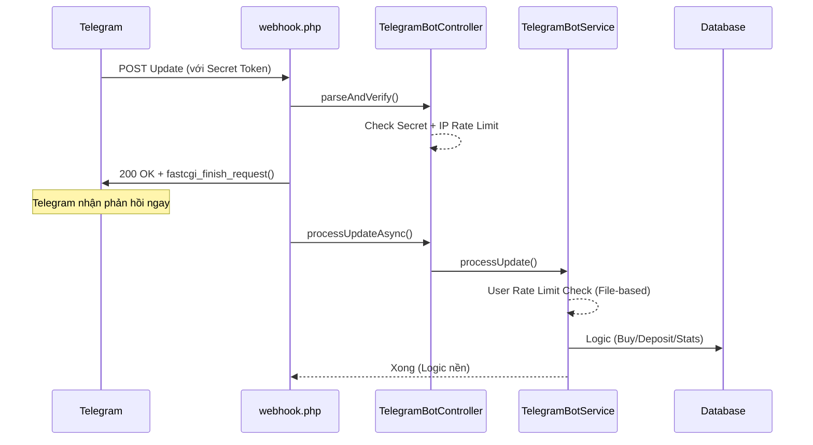

# KaiShop Telegram Bot — Tổng Quan Hệ Sinh Thái

## Mục đích

Bot Telegram là **kênh bán hàng thứ hai** của KaiShop, hoạt động song song với Website. User có thể **mua sản phẩm, nạp tiền, xem đơn hàng** ngay trên Telegram mà không cần mở trình duyệt.

**Đặc điểm nổi bật:**
- **Standalone Store**: Bot hoạt động độc lập. User mới được tự động cấp "Shadow Account" để mua hàng ngay mà không bắt buộc liên kết Web.
- **Shared Brain**: Dùng chung 100% code backend với Web (Model, Service, Database).
- **Production Ready**: Tối ưu với Webhook Async, Outbox Worker và File-based Rate Limiting.

---

## Kiến trúc Standalone

Khi một user gõ `/start`, hệ thống sẽ:
1. Kiểm tra link trong `user_telegram_links`.
2. Nếu chưa có: Tự động tạo một `User` record mới (username dạng `tg_{id}`) và tạo link.
3. Cho phép User nạp tiền và mua hàng ngay lập tức.
4. **Liên kết (Linking)**: Trở thành tính năng tùy chọn để nhập lịch sử từ tài khoản Web có sẵn sang Telegram hoặc ngược lại.

---

## Cấu trúc file & Lớp dữ liệu

| Thư mục / File | Vai trò |
| :--- | :--- |
| `app/Services/TelegramConfig.php` | **OOP Config**: Tập trung hằng số, rate limit, admin IDs, secret tokens |
| `app/Helpers/AppCache.php` | **Persistent Cache**: Lưu trữ file-based (getMe, webhookInfo) |
| `app/Services/TelegramService.php` | API wrapper cấp thấp (cURL, Keyboard Builder) |
| `app/Services/TelegramBotService.php` | **Bộ não**: xử lý toàn bộ lệnh, callback, standalone logic |
| `app/Models/UserTelegramLink.php` | Mapping user web ↔ Telegram ID |
| `app/Models/TelegramOutbox.php` | Hàng đợi gửi thông báo (Outbox Pattern) |
| `public/telegram/webhook.php` | Webhook entry point (dùng `fastcgi_finish_request`) |
| `public/telegram/cron.php` | Worker Parallel (Parallel cURL) + Cleanup GC |

---

## Luồng Xử Lý Webhook (Production)

---

## Danh sách tài liệu chi tiết

| # | File | Nội dung |
| :--- | :--- | :--- |
| 01 | `01-commands.md` | Danh sách lệnh Bot (theo phân quyền User/Admin) |
| 02 | `02-shop-purchase-flow.md` | Luồng mua hàng (Browse -> Order -> Shadow Account) |
| 03 | `03-wallet-deposit.md` | Quản lý ví và nạp tiền (Standalone & Linked) |
| 04 | `04-account-linking.md` | Quy trình liên kết tài khoản web (Optional sync) |
| 05 | `05-webhook-polling.md` | Kỹ thuật Webhook Async, Outbox Worker & Cron |
| 06 | `06-admin-commands.md` | Lệnh quản trị (/stats, /broadcast, /maintenance) |
| 07 | `07-admin-panel.md` | Dashboard quản lý trên Web |
| 08 | `08-security.md` | Bảo mật: Secret, Rate Limit, Anti-flood, Ban sync |
| 09 | `09-database.md` | Schema database & Migrations |
| 10 | `10-deployment.md` | Hướng dẫn cài đặt & vận hành |
